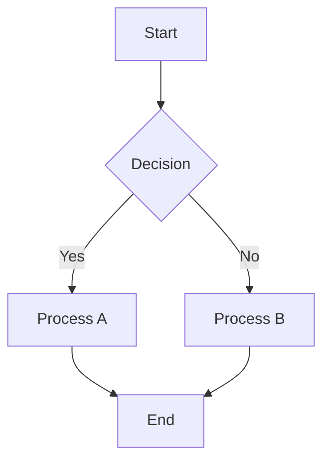
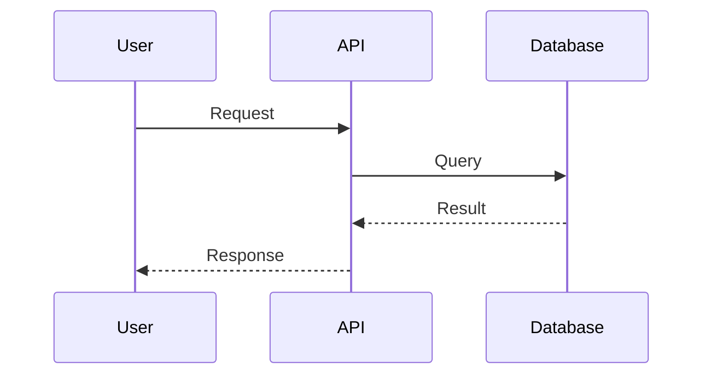
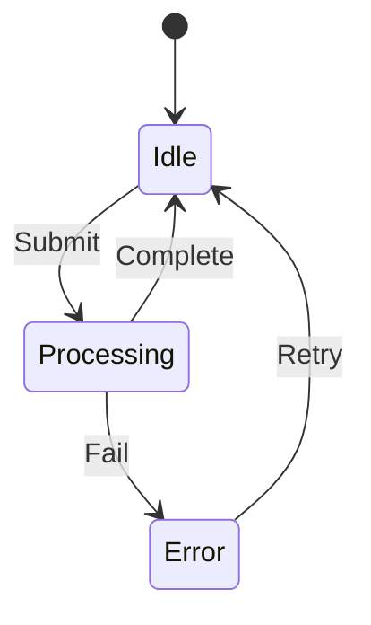
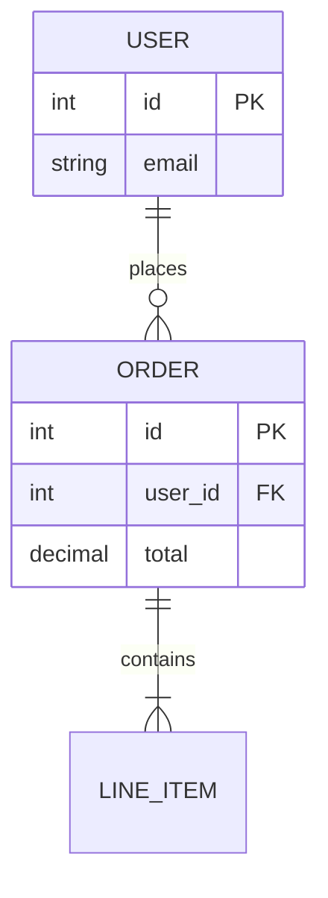

# Diagram Generation

Generate Mermaid diagrams from descriptions, code analysis, or system understanding.

## When to Use This Skill

- Documenting system architecture
- Visualizing code flows and control flow
- Creating sequence diagrams for API interactions
- Modeling domain entities and relationships (ERD)
- Showing state machines and lifecycle transitions
- Planning processes and decision trees
- Communicating designs before implementation

## Supported Diagram Types

| Type | Use When | Mermaid Keyword |
|------|----------|----------------|
| Flowchart | Processes, decision logic, control flow | `flowchart TD` or `flowchart LR` |
| Sequence | API calls, time-ordered interactions | `sequenceDiagram` |
| Class | OOP design, domain models | `classDiagram` |
| ER | Database schemas, table relationships | `erDiagram` |
| State | State machines, lifecycle states | `stateDiagram-v2` |
| C4 | System context, containers, components | `C4Context` or `C4Container` |
| Architecture | Infrastructure, deployment | `architecture-beta` |

## Core Workflow

1. **Identify diagram type** — match the user's intent to the right type from the table above.
2. **Extract key elements** — entities, actors, components, states, relationships.
3. **Choose direction** — `TD` (top-down) for hierarchies, `LR` (left-right) for linear flows.
4. **Generate Mermaid code** — syntactically correct, with meaningful labels.
5. **Keep it readable** — limit to 15-20 nodes per diagram. Split if larger.
6. **Offer rendering** — if the `mcp-mermaid` MCP is available, use it to render to PNG/SVG. Otherwise, output the Mermaid code block.

## Rendering

If `mcp-mermaid` MCP server is available, use `generate_diagram` tool to render. Otherwise, output as a fenced `mermaid` code block — GitHub renders these natively in Markdown.

For CLI rendering (when `@mermaid-js/mermaid-cli` is installed):
```bash
npx mmdc -i diagram.mmd -o diagram.svg -t dark -b transparent
```

## Quick Reference

### Flowchart


### Sequence Diagram


### State Diagram


### ER Diagram


### C4 Context
```mermaid
C4Context
    title System Context
    Person(user, "User")
    System(app, "Application")
    System_Ext(db, "Database")
    User -> App
    App -> Db
```

## Constraints

### MUST DO
- Choose the diagram type that best communicates the intent
- Use meaningful labels, not abbreviations
- Group related components with subgraphs when helpful
- Keep diagrams focused — one concept per diagram
- Use consistent direction (TD or LR) within a diagram

### MUST NOT DO
- Cram more than 20 nodes into one diagram
- Use ambiguous labels like "thing" or "process"
- Mix diagram types in a single block
- Skip relationships — isolated nodes convey no information

## Best Practices

- **Version control diagrams** — Mermaid is text, so diffs are meaningful
- **Update when code changes** — stale diagrams are worse than none
- **Use subgraphs** for logical grouping in complex flowcharts
- **Add titles** — `title My Diagram` at the top of C4/architecture diagrams
- **Color coding** — use `style` or `class` for visual emphasis on critical paths
